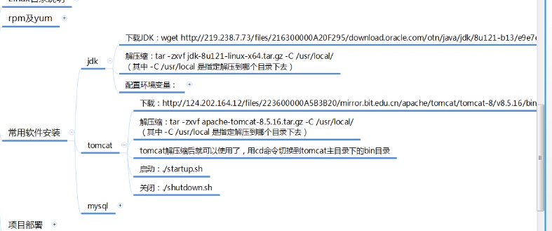

### 权限

chomd 

更改权限

w--4

r---2

x---1

chown 更改所属拥有者

chgrp 修改文件所属组

id root 查看所属组

### 文件命令

grep 搜索

sort 对所有行的首字母排序

unip 减少重复的行

wc 统计多少行 单词数 字符数

 

 

curl 抓取网页内容

wget 下载 加链接

wget 下载链接

### 编辑文件vi和升级的vim

vim 下的命令 dd 删除当前行

yy 复制当前行

p 粘贴

gg 光标返回第一行

GG 光标返回最后一行

^ 光标回到当前行行首

 $ 光标回到当前行行尾

/加字符 n查询下一个

 

### linux 目录说明

bin user/bin 存放最常使用的命令

boot 存放启动linux 时使用的一些核心文件，包括一些链接文件以及镜像文件

dev Device (设备) 该目录存放的时linux 的外部设备,linux中的设备也是以文件形式存在

etc 这个目录存放所有的系统管理所需要的配置文件//（环境变量）(编辑环境变量在/etc/profile) 

lib 这个目录存放着系统最基本的动态链接共享库，其作用类似window的dll文件 ，几乎所有的应用程序都要用到这些共享库。

media linux 系统会自动识别一些设备，例如U盘，光驱，当时别后linux 会把识别的设备挂接到这个目录下

mnt 系统提供该目标是为了让用户临时挂载别的文件系统，我们可以将光驱挂载在/mnt/上，然后进入该目录就可以查看光驱内容

opt 放下载的软件	

proc 可以查看硬件信息

run 文件syslogd.pid服务启动产生内容

sbin Super User 的意思，这里存放的是系统管理员使用的系统管理程序

srv 存放一些服务启动之后需要提取的数据

sys

tmp 这个目录是用来系统缓存临时文件

usr 用户很多应用程序和文件都存放在这个目录下，类似program files 的目录

var 存放经常修改的文件

 

### rpm yum

rpm 不处理依赖

安装rpm包的软件 ：rpm -ivh xxx.rpm

查看是否安装了某个rpm包 ：rpm -qa | gerp 包名

删除某个rpm 软件包：rpm -e xxx.rpm

rpm 要先下载

yum 

yum search 名字 查找软件包名

yum install telnet

yum remove 包名

yum list installed 列出所有已安装的软件包命令

yum clean all  （yum install 后的rpm包存放在/var/cache/yum/下）清理yum 安装已下载的包

编辑环境变量在/etc/profile 

export JAVA_HOME=/usr/local/jdk1.8.0_121

export PATH=$JAVA_HOME/bin: \$PATH

export CLASSPATH=.:$JAVA_HOME/lib/dt.jar:\$JAVA_HOME/lib/tools.jar:\$JAVA_HOME/jre/lib/rt.jar

配置环境变量以后要source profile 

远程连接mysql 链接不上是防火墙的原因

查看防火墙状况：systemctl status firewalld

让防火墙可用：systemctl anable firewalld

让防火墙不可用：systemctl disable firewalld

启动防火墙：systemctl start firewalld

关闭防火墙：systemctl stop firewalld

 

 

export JAVA_HOME=/usr/local/jdk1.8.0_321
export PATH=$JAVA_HOME/bin:$PATH
export CLASSPATH=.:$JAVA_HOME/lib/dt.jar:$JAVA_HOME/lib/tools.jar:$JAVA_HOME/jre/lib/rt.jar

yum -y install mysql-server --nogpgcheck

TFyDebci(3//

set global validate_password_length=11;

ALTER USER 'root'@'localhost' IDENTIFIED BY 'qazxc125860'; 