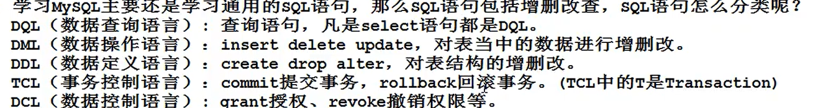

# 数据库

	

source +sql脚本

create database mysqltext;

drop database mysqltext;

show databases;

use mysqltext;

show tables;

desc 表名；---->查看表结构

show create table emp; 查看表的sql语句

select  [列名 ] [可以数学运算] [as wujinke(改名字)‘武金科’] from [表名字]

标准sq字符转用单引号分割，mysql 支持双引号，但是别用。

 

## 条件查询

select 

	列名；

from

	表名；

where

	条件；

select ename from emp where sal= 5000;

select ename,job from emp where job in ('SALESMAN','MANAGER')

##### 模糊查询 like

%代表任意多个字符，_代表任意一个字符

select ename from emp where ename like '%O%';

\具有转义作用

# 排序

select 

	列名；

from

	表名；

order by 

	列名2;

					--->按列名2排序

select ename ,sal from emp order by sal asc;

asc 升序

desc 降序

# 分组

#### 多行处理函数

count 计数

sum 求和

avg 平均

max（） 最大

min () 最小

count (*):统计表中的总条数

count(comm):表示统计comm 中不为NULL的条数

#### 单行处理函数

ifnull(可能为NULL的数据，被当作的值)

 

 

select 

	列名

from 

	表名

group by

    列名；

				-->分组

 

select

from 

group by 

having 对进行分组完过滤

 

### 总结

select ---->那个值

from ---->那个表

where --->条件

group by  --->分组

having --->分组完判断

order by --> 排序
